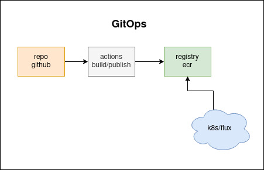

##GitOps <h2>
  

###Dennis flux

>Este repositorio é responsavel por realizar os deploys e criar as services no *k8s*.
>Segue o link da documentação para mais detalhes  <https://fluxcd.io/docs/> e <https://kustomize.io/>.

* https://github.com/ZupIT/dennis-flux/

>Exemplos:
> * ``fluxctl --k8s-fwd-ns flux sync``
> * ``fluxctl release --update-all-images --interactive --all --k8s-fwd-ns flux``
> * ``fluxctl list-images --workload dev:deployment/dennis-middleware --k8s-fwd-ns flux``
> * ``fluxctl install --manifest-generation=true --git-user=$GH_USER --git-email=$GH_EMAIL --git-url=git@github.com:ZupIT/dennis-infra.git --git-path=staging --namespace=flux --sync-interval=2m --git-poll-interval=2m | kubectl apply -f -``

###Dennis Infra
>Este repositorio é responsável por criar toda a infra do projeto.
>Segue o link da documentação para mais detalhes  <https://www.terraform.io/> e <https://helm.sh/>.

* https://github.com/ZupIT/dennis-infra/

>Exemplos:
> * ``ENVIRONMENT=dev make init``
> * ``ENVIRONMENT=stg make plan``
> * ``ENVIRONMENT=prod make apply``

